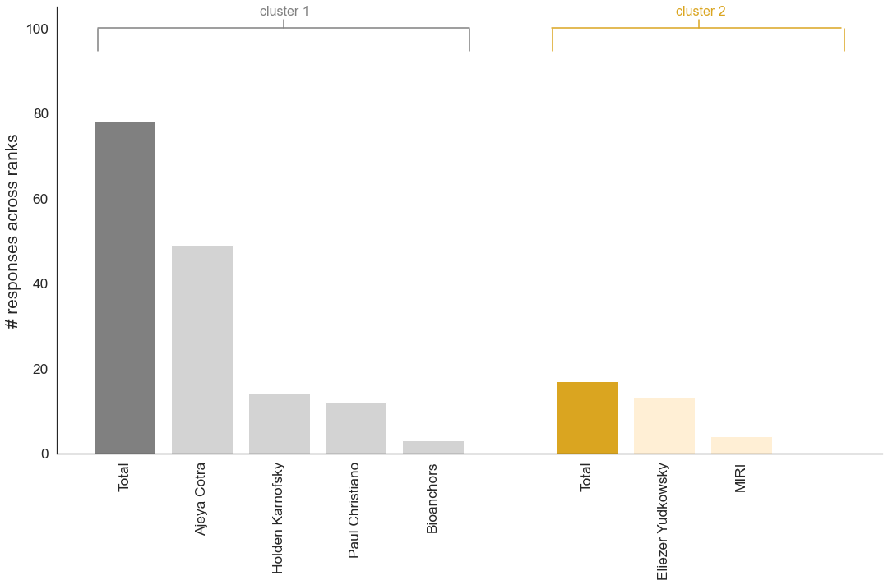
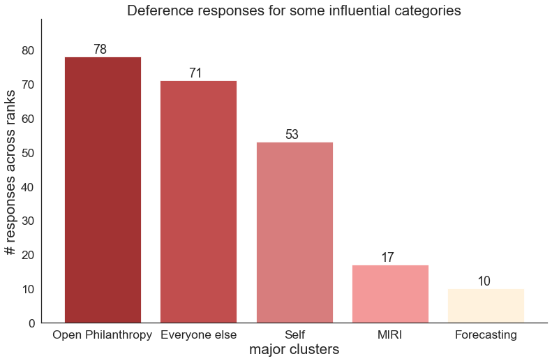

# AI timelines deference

A very brief analysis of the [AI timlines deference survey](https://forum.effectivealtruism.org/posts/FtggfJ2oxNSN8Niix/when-reporting-ai-timelines-be-clear-who-you-re-not) conducted by [Sam Clarke](https://www.governance.ai/team/sam-clarke). Please see the forum post for the motivation and outline of this survey, and the [notebook](https://github.com/mccaffary/AI-timelines-deference/blob/main/src/timeline_deference_survey_visualisation_updated_.ipynb) for some (very basic) exploratory data analysis of the responses.

> Some people and organisations have highly correlated views (as evidenced by co-authoring the same report or repeatedly expressing similar views in public). This figure shows the number of deference responses for two influential, but ideologically different, clusters.

> If we bin the overall responses into five main categories ("Open Philanthropy cluster", "MIRI cluster", "Self" responses, "Forecasting cluster", and simply "Everyone else" who received a deference, we get something that looks like this. Note that "Open Philanthropy cluster" = [Ajeya Cotra, Holden Karnofsky, Paul Christiano, and the Bioanchors report], "MIRI cluster" = [MIRI, Eliezer Yudkowsky], and "Forecasting cluster" = [Metaculus, Samotsvety].
